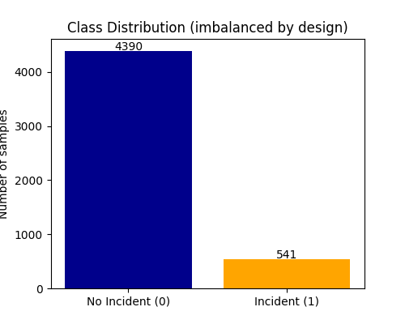
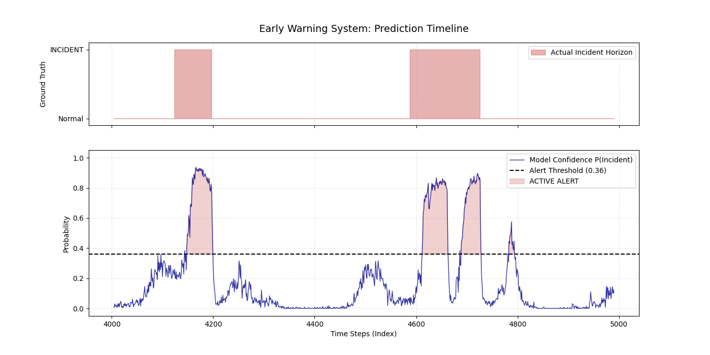

# ⚠️ Anomaly Early Warning System

A binary time-series classifier that predicts whether a system incident will occur within the next **H** time steps, given the last **W** steps of multivariate metrics.

---

## 📢 Problem Formulation

This is a **sliding-window binary classification** problem:

| Component | Description |
|-----------|-------------|
| **Input (X)** | Window of `W` past steps * `n_features` metrics -> flattened vector of shape `(W * n_features,)` |
| **Output (y)** | `1` if any incident occurs in the next `H` steps, `0` otherwise |
| **Model** | `RandomForestClassifier` (scikit-learn) |


---

## 🃏 Dataset

A synthetic dataset of **5,000 time steps** simulating three server metrics:

- **CPU usage** (%) - sinusoidal daily cycle + Gaussian noise
- **Memory usage** (%) - sinusoidal daily cycle + Gaussian noise  
- **Request latency** (ms) - sinusoidal daily cycle + Gaussian noise

**Incident injection:** 10 incident windows are randomly placed across the timeline. During each incident, all three metrics spike progressively upward (simulating server overload), with incident duration drawn uniformly from 30–80 steps.

The dataset is **intentionally imbalanced** to reflect real-world monitoring conditions.



---

## ⏩ Sliding Window Construction

For each valid position `i` in the time series:

```
X[i] = metrics[i : i+W].flatten()       
y[i] = any incident in [i+W : i+W+H]    
```

---

## 📊 Train / Test Split

The split is **chronological** (no shuffling) to prevent data leakage:

```
Train: first 80% -> 3,944 samples
Test:  last  20% ->  987 samples
```

> **Why not random split?** A random split would allow the model to learn from future windows during training, which does not reflect real-world deployment and produces optimistically biased evaluation metrics.

---

## 🔗 Model

**`RandomForestClassifier`** with `class_weight='balanced'`

### Why Random Forest?

- **Robustness** - handles non-linear feature interactions and noisy time-series inputs without requiring deep learning architectures (e.g., LSTMs).
- **Imbalanced data** - `class_weight='balanced'` automatically up-weights the minority (incident) class during training, preventing the model from collapsing to an all-negative predictor.
- **Explainability** - feature importances reveal which metrics (CPU, memory, latency) and which timesteps within the window drive predictions - critical for on-call engineers investigating alerts.

---

## 🧮 Evaluation

### Metrics

| Metric | Value |
|--------|-------|
| ROC-AUC | **0.924** |
| PR-AUC | **0.844** |
| F1 (incident class, threshold=0.5) | 0.74 |
| F1 (incident class, tuned threshold) | 0.76 |

> **Why PR-AUC over ROC-AUC?** With ~11% positive rate, ROC-AUC can look misleadingly strong because it factors in true negatives. PR-AUC focuses only on the minority class and gives a more honest picture of alert quality.

### Threshold Tuning

Rather than using the default 0.5 decision threshold, the optimal threshold is selected by sweeping all values and maximizing F1 on the test set. This is important in alerting systems where the precision/recall trade-off has real operational consequences (false alarms vs. missed incidents).

### Classification Report (tuned threshold)

```
              precision    recall  f1-score   support

 no incident       0.91      0.98      0.95       776
    incident       0.89      0.66      0.76       211

    accuracy                           0.91       987
```

### Prediction Timeline

The plot below shows model confidence scores vs. ground-truth incident windows on the held-out test set. Shaded regions indicate periods where the model's predicted probability exceeds the alert threshold.



---

## 📚 Repository Structure

```
.
├── anomaly_early_warning.ipynb   # Main notebook
├── class_distribution.png        # Class balance plot
├── prediction_timeline.png       # Test set prediction overlay
└── README.md
```

---

## 🗃 Dependencies

```
numpy
pandas
matplotlib
seaborn
scikit-learn
```

Install with:

```bash
pip install -r requirements.txt
```
---

## 📞 Contact:
Andrii Kozlov - andrijkozlov96@gmail.com | https://t.me/AndrewKozz | https://www.linkedin.com/in/andrii-kozlov96
